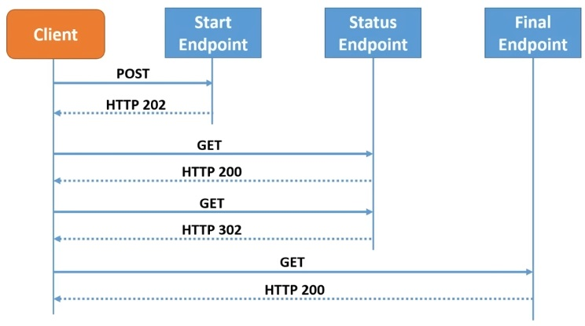

# Asynchronous API with .NET and SignalIR.

## Sobre o projeto

Projeto baseado no curso [Asynchronous APIs with .NET](https://www.youtube.com/watch?v=LCbR58sCmvQ).

O projeto utiliza a Asynchronous Request Reply Pattern, onde é retornado para o cliente um endpoint onde ele irá poder consultar o status da requisição.

Fluxo da pattern 

*Fonte: Asynchronous API with .NET - les Jackson*

## Rodando o projeto

Executar Migrations
`dotnet ef migrations add initialmigration`

Aplicar as migrations
`dotnet ef database update`

## Artigos relacionados

<https://learn.microsoft.com/en-us/azure/architecture/patterns/async-request-reply?WT.mc_id=DX-MVP-5004571>